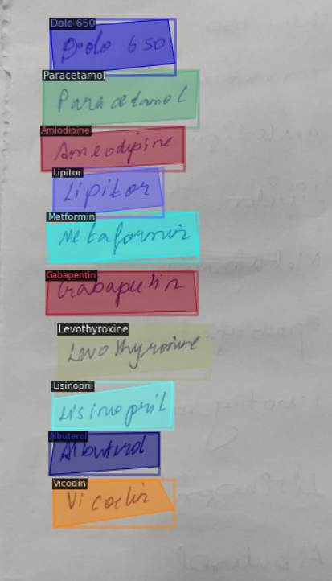

# Prescription Reader

Internship project at the International Centre for Emerging Technologies (ICET): detecting handwritten medicine names in prescription images with Detectron2, trained on a custom dataset.

## Workflow

1. Collect images of handwritten medicine names
2. Annotate them with labelme
3. Convert the labelme annotations to COCO format with `jsontococo.py`
4. Train a Detectron2 model in Google Colab
5. Run the trained model on new images

## Contents

| File | Purpose |
|---|---|
| `training_detectron_model.ipynb - Colaboratory.pdf` | PDF export of the Colab training notebook |
| `jsontococo.py` | Converts labelme JSON annotations to a COCO dataset |
| `Detectron2_Documentation.docx` | Notes on setting up and using Detectron2 |
| `References.txt` | Research papers behind the problem statement |
| `Sample_Output.png` | Example detection result |

The repository also contains saved web page files (`.html`, `.css`, `.download`) from a Colab page export. They are not needed to understand or run the project.

## License

See [LICENSE](LICENSE).
